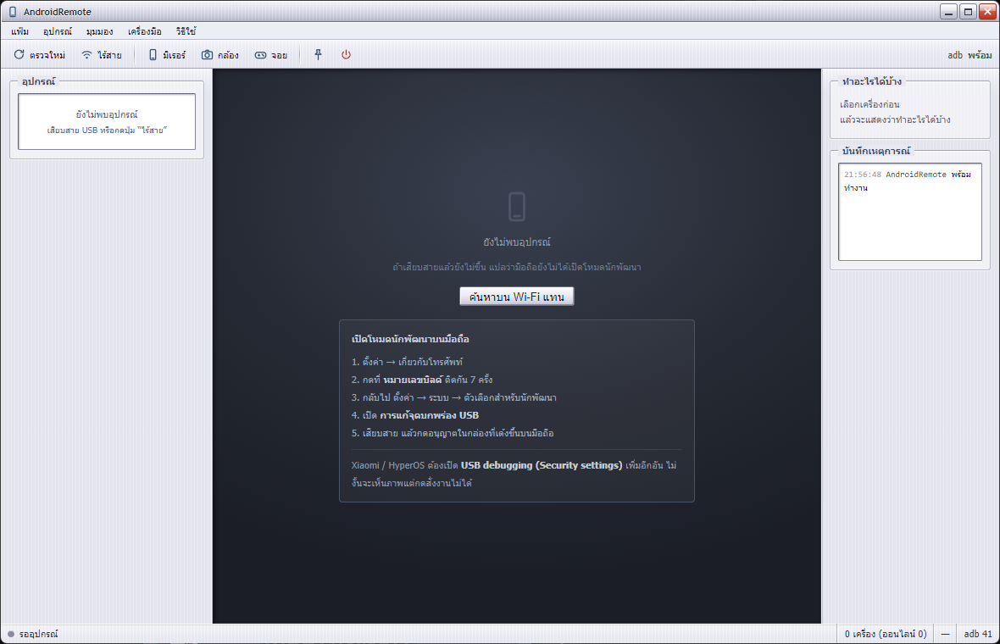
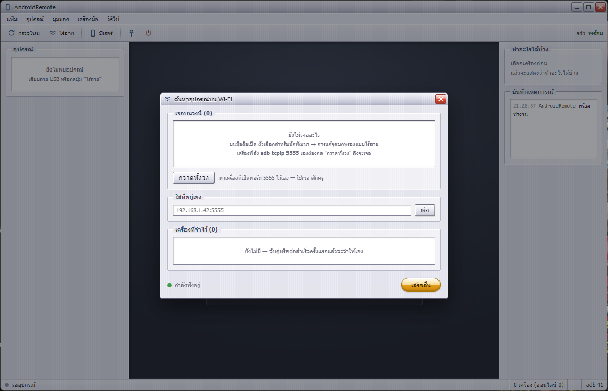
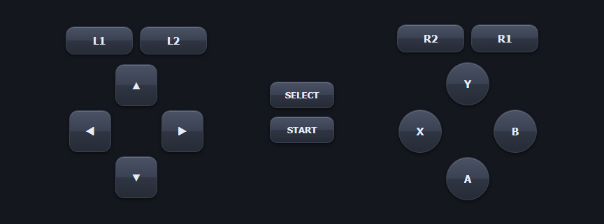
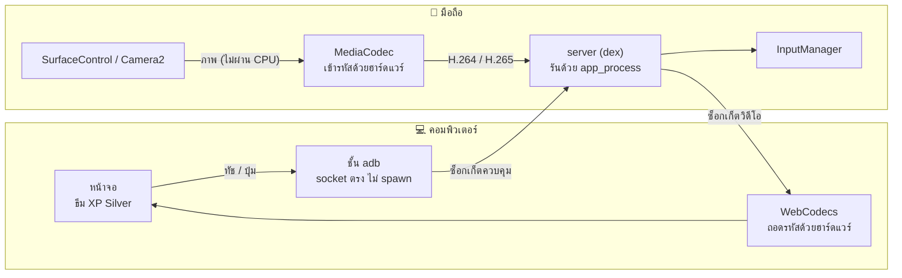

<div align="center">


# AndroidRemote

**คุมมือถือแอนดรอยด์จากคอมพิวเตอร์ — มิเรอร์จอ ใช้กล้องแทนเว็บแคม และทำมือถือเป็นจอยเกม**

[](https://github.com/xjanova/AndroidRemote/releases/latest)
[](https://github.com/xjanova/AndroidRemote/actions)


</div>



---

## ทำอะไรได้บ้าง

| | โหมด | รายละเอียด |
|:--:|---|---|
| 🖥️ | **มิเรอร์จอ** | เห็นจอมือถือบนคอม กดสั่งงานได้ ปิดจอมือถือแล้วยังคุมต่อได้ |
| 📷 | **กล้องแทนเว็บแคม** | ใช้กล้องมือถือทุกตัวที่มี เลือกกี่ตัวก็ได้ เปิดพร้อมกันได้ถ้าเครื่องรองรับ |
| 🎮 | **จอยเกม** | มือถือกลายเป็นจอย ผูกปุ่มกับคีย์บอร์ดเองได้ **ไม่ต้องลงแอป** |
| 📡 | **ค้นหาบน Wi-Fi** | หาเครื่องในวงเดียวกันเอง เจอเครื่องที่เคยจับคู่แล้วต่อให้ทันที |
| 🧩 | **หลายเครื่องพร้อมกัน** | เปิดกี่เครื่องก็ได้ในหน้าต่างเดียว แตะจอไหนคุมเครื่องนั้น หยุดทีละเครื่องได้ |
| 🤖 | **มาโครและตั้งเวลา** | บันทึกสิ่งที่ทำบนจอ แล้วเล่นซ้ำไปทุกเครื่องพร้อมกัน วนได้ ตั้งเวลาได้ หา element แทนพิกัดดิบได้ |
| 👁️ | **ตาสำหรับเกม** | หาภาพ (template) และอ่านตัวเลข (OCR) บนจอเกมที่ไม่มีโครง UI · ตัดเทมเพลตจากภาพจอในแอป · รอภาพโผล่/หาย · เงื่อนไข/กระโดด |
| 🧬 | **เครื่องใครเครื่องมัน** | โปรไฟล์ต่อเครื่อง (ตัวแปร `{{username}}` + เสียง) — มาโครเดียวกันแต่ละเครื่องทำต่างกัน · log แยกเครื่อง · สุ่มให้เหมือนคน · นโยบายเมื่อพัง |
| 🧠 | **ตา AI** | บอกเป็นคำพูดว่าจะแตะอะไร ("close X button top right") แล้วโมเดลภาพบนเครื่องคุณ (Ollama) หาให้ · ตั้งชื่อหน้าจอ/บอกปุ่มเอง · **จำหน้าที่เคยเห็น** (dHash) ครั้งต่อไปไม่ถามซ้ำ · รอหน้า/เงื่อนไขตามชื่อหน้า · ถามคำถามเกี่ยวกับจอเก็บตัวแปร |

ภาพวิ่งจากจอมือถือเข้าตัวเข้ารหัสฮาร์ดแวร์แล้วออกซ็อกเก็ตตรงๆ **ไม่มีการก็อปพิกเซลผ่าน CPU เลยสักขั้น**
ฝั่งคอมถอดรหัสด้วย WebCodecs ซึ่งใช้ฮาร์ดแวร์ให้อัตโนมัติ

### ตา AI ต้องมีอะไร

ติดตั้ง [Ollama](https://ollama.com) บนคอมเครื่องเดียวกัน แล้วดึงโมเดลภาพหนึ่งตัว (ค่าเริ่มต้น `qwen3-vl:4b` ~3.3 GB พอดีการ์ดจอ 8 GB)

```bash
ollama pull qwen3-vl:4b
```

เปลี่ยนโมเดล/ความกว้างภาพได้ในแท็บ **เทมเพลตภาพ → หน้าจอที่ AI จำได้**
โมเดลใช้เวลา 5-20 วินาทีต่อคำถามบน GTX 1070 Ti จึงเหมาะกับเกมแนว turn-based / idle / เก็บของรายวัน ไม่ใช่เกม real-time
ทุกหน้าที่โมเดลเคยดูจะถูกจำไว้ (`games/<ชื่อเกม>/screens.json` ในโฟลเดอร์ข้อมูลแอป) เจอหน้าเดิมอีกตอบได้ทันทีไม่ต้องถาม

---

## ดาวน์โหลด

จาก [หน้า Releases](https://github.com/xjanova/AndroidRemote/releases/latest)

| ไฟล์ | จำเป็นไหม | ใช้ทำอะไร |
|---|:--:|---|
| `AndroidRemote-<เวอร์ชัน>-setup.exe` | ✅ ต้องมี | ตัวโปรแกรมบนคอม ติดตั้งครั้งเดียว รุ่นถัดไปอัปเดตให้เอง |
| `AndroidRemote-companion.apk` | ⬜ ไม่บังคับ | แอปบนมือถือ ช่วยให้การต่อไร้สายรอดการรีบูต |

> ฟีเจอร์หลักทั้งหมดใช้ได้ครบโดย**ไม่ต้องลง APK** — มันเป็นของเสริมล้วนๆ

---

## เริ่มใช้งาน

**1. เปิดโหมดนักพัฒนาบนมือถือ**

ตั้งค่า → เกี่ยวกับโทรศัพท์ → กดที่ **หมายเลขบิลด์** ติดกัน 7 ครั้ง
แล้วไปที่ ตั้งค่า → ระบบ → ตัวเลือกสำหรับนักพัฒนา → เปิด **การแก้จุดบกพร่อง USB**

**2. เสียบสาย แล้วกดอนุญาตบนมือถือ**

**3. เปิดแอปแล้วกด "เริ่มมิเรอร์"**

> [!IMPORTANT]
> **Xiaomi / HyperOS / MIUI** ต้องเปิด **USB debugging (Security settings)** เพิ่มอีกหนึ่งอัน
> ไม่งั้นจะเห็นภาพแต่กดสั่งงานไม่ได้ — และสวิตช์นี้เปิดไม่ได้ถ้ายังไม่ล็อกอินบัญชี Mi

---

## ต่อผ่าน Wi-Fi



หาเครื่องสามทางพร้อมกัน เพราะไม่มีทางไหนเห็นครบเอง

| ทาง | เห็นอะไร |
|---|---|
| mDNS | แอนดรอยด์ 11+ ที่เปิดไร้สาย รวมเครื่องที่**กำลังเปิดหน้าจับคู่อยู่** |
| `adb mdns` | สแตกของ adb เอง บางทีเห็นในสิ่งที่ตัวแรกมองไม่เห็น |
| กวาดพอร์ต | ทางเดียวที่เจอเครื่องซึ่งสั่ง `adb tcpip` เอง เพราะพวกนี้เงียบสนิทบน mDNS |

จับคู่ครั้งเดียว ครั้งถัดไปเจอบนวงเมื่อไหร่ต่อให้เลยไม่ต้องถาม
(จำด้วย `ro.serialno` ไม่ใช่ IP เพราะ IP เปลี่ยนทุกครั้งที่ DHCP อยาก)

---

## โหมดจอยเกม



คอมเปิดเว็บเซิร์ฟเวอร์ มือถือเปิดหน้านั้นในเบราว์เซอร์ — **ไม่ต้องลงแอปอะไรเลย**
ใช้กับ iPhone หรือแท็บเล็ตเครื่องไหนก็ได้ และไม่ต้องพึ่ง adb

- 14 ปุ่ม กดหลายนิ้วพร้อมกันได้
- ผูกปุ่มกับคีย์บอร์ดเองได้ทุกปุ่ม จำค่าไว้ให้
- ส่งเป็น **scan code** ไม่ใช่ virtual key เพราะเกมที่อ่านผ่าน DirectInput มองไม่เห็น virtual key

---

## ระดับสิทธิ์

แอปตรวจให้เองว่าเครื่องนี้ยิงคำสั่งได้ระดับไหน แล้วเปิดปิดฟีเจอร์ตามนั้น

| ระดับ | ได้มายังไง | ปลดล็อกอะไร |
|---|---|---|
| **shell** | เปิด USB debugging | มิเรอร์ · สั่งงาน · เสียง · คลิปบอร์ด · ไฟล์ · จัดการแอป · แก้ค่าระบบ |
| **Shizuku** | เปิดบริการ Shizuku ไว้ | เท่า shell แต่ไม่ต้องเสียบสายทุกครั้ง |
| **root** | `adb root` หรือ `su` | สั่งงานตอนล็อกจอ · เขียน `/dev/input` ตรง · เข้าถึงข้อมูลแอปอื่น · ติดตั้งเป็นแอประบบ · คุมทุกโพรเซส · สลับ SELinux |

---

## สถาปัตยกรรม



ฝั่งมือถือไม่ใช่แอป — เป็นโพรเซส Java เปล่าที่ยิงเข้าไปรันด้วย `app_process`
มี uid เท่ากับคนที่สั่งรัน (2000 ถ้ามาทาง adb, 0 ถ้ามาทาง `su`)

---

## สร้างจากซอร์ส

ต้องมี **Node 20+**, **JDK 17**, **Android SDK** (build-tools + platform)

```bash
npm install
npm run native:build     # server ฝั่ง Android (dex) + ตัวฉีดคีย์ (exe)
npm run dev              # เปิดโหมดพัฒนา
```

<details>
<summary><b>คำสั่งทั้งหมด</b></summary>

| คำสั่ง | ทำอะไร |
|---|---|
| `npm run dev` | เปิดโหมดพัฒนา hot reload |
| `npm run build` | ตรวจชนิด + bundle |
| `npm run server:build` | คอมไพล์ server ฝั่ง Android เป็น dex |
| `npm run helper:build` | คอมไพล์ตัวฉีดคีย์เข้า Windows |
| `npm run apk:build` | สร้าง APK แอปคู่หู |
| `npm run apk:keygen` | สร้างกุญแจเซ็นแอปตัวจริง (ทำครั้งเดียว) |
| `npm run smoke:adb` | ทดสอบชั้น adb กับเครื่องจริง |
| `npm run smoke:discovery` | ทดสอบการค้นหาบนวง LAN |
| `npm run smoke:gamepad` | ทดสอบเซิร์ฟเวอร์จอย |
| `npm run dist` | สร้างตัวติดตั้ง Windows |

</details>

<details>
<summary><b>สิ่งที่เลือกไว้ตั้งใจ</b></summary>

- **ไม่ใช้ Gradle** — ฝั่ง Android คอมไพล์ด้วย `javac` + `d8` + `aapt2` ตรงๆ ซึ่งมีอยู่ใน SDK อยู่แล้ว build เสร็จในไม่กี่วินาที ไม่ต้องมี daemon กิน RAM ค้าง
- **ไม่มีเฟรมเวิร์กฝั่งหน้าจอ** — ต้องวาดวิดีโอ 60–120 fps การมี virtual DOM คั่นกลางมีแต่เสีย
- **runtime dependency ตัวเดียว** (`electron-updater`) นอกนั้นใช้ของที่มีในระบบล้วน
- **คุย adb ผ่าน socket ตรง** ไม่ spawn `adb.exe` ต่อคำสั่ง ได้ `track-devices` แบบ push และไม่เสีย 20–60 ms ต่อคำสั่งไปกับการเปิดโพรเซส

</details>

---

## สถานะ

| ส่วน | สถานะ |
|---|---|
| ชั้น adb · ตรวจเครื่อง · ระดับสิทธิ์ | ✅ ทดสอบกับ adb จริงแล้ว |
| ค้นหาบนวง Wi-Fi · จำเครื่อง | ✅ กวาด 253 ที่อยู่ใน 1.3 วินาที |
| เซิร์ฟเวอร์จอย · โปรโตคอล WebSocket | ✅ ผ่านครบ 9 ข้อ |
| ท่อ build (dex · exe · APK · installer) | ✅ ปล่อยขึ้น Release ได้จริง |
| มิเรอร์จอ · กล้อง · การยิงอินพุต | ⚠️ เขียนครบ **ยังไม่เคยทดสอบกับมือถือจริง** |
| จอยจากเบราว์เซอร์มือถือ | ⚠️ โปรโตคอลถูกต้องระดับไบต์ ยังไม่เคยเห็นเบราว์เซอร์จริงต่อสำเร็จ |
| มาโคร: แกะโครงหน้าจอ · ตัวบันทึก · ตัวตั้งเวลา | ✅ ทดสอบผ่าน (`npm run smoke:automation`) |
| มาโคร: เล่นซ้ำบนเครื่องจริง · หลายเครื่องพร้อมกัน | ✅ พิสูจน์กับอีมูเลเตอร์ 2 เครื่องพร้อมกัน (มาโครสัดส่วนข้ามความละเอียด) |
| automation v2: ตัวแปร/โปรไฟล์ต่อเครื่อง · หาภาพ · OCR · เสียง · เงื่อนไข | ✅ ทดสอบผ่านกับ 2 เครื่องจริง + เกมเบราว์เซอร์ (`npm run smoke:automation2`) |
| ตา AI: โมเดลภาพผ่าน Ollama · แค็ตตาล็อกหน้าจอ · ขั้นตอน vlm_tap / wait_screen / if_screen / vlm_var | ✅ พิกัดที่ AI ตอบเทียบกับ uiautomator แล้วตรง · แตะจากคำบรรยายแล้วหน้าเปลี่ยนจริง (`npm run smoke:vlm`) |
| เสียง (REMOTE_SUBMIX) | ⬜ ยังไม่ได้ทำ |
| พิมพ์ภาษาไทยเข้าเครื่อง | ⬜ ทางปัจจุบันพิมพ์ได้แต่อักษรละติน ต้องทำ UHID หรือ IME เอง |

> [!NOTE]
> โปรเจกต์นี้ยังอยู่ในช่วงแรก ส่วนที่ยังไม่ได้ทดสอบกับเครื่องจริงเขียนบอกไว้ตรงๆ ข้างบน
> คอมไพล์ผ่านไม่ได้แปลว่าใช้ได้

---

## ปล่อยรุ่นใหม่

```bash
git tag v0.2.0 && git push origin v0.2.0
```

แค่นั้น — workflow จะ build ทั้งตัวติดตั้งและ APK แล้วขึ้น Release เดียวกันให้เอง
เวอร์ชันมาจาก tag ที่เดียว ทั้ง `package.json` และ `versionCode` ของ APK จะได้ไม่มีทางไม่ตรงกัน

ครั้งแรกต้องสร้างกุญแจเซ็น APK ก่อนด้วย `npm run apk:keygen` แล้วทำตามที่มันบอก

> [!CAUTION]
> **สำรองไฟล์กุญแจไว้ที่ปลอดภัย** — APK ที่เซ็นคนละกุญแจอัปเดตทับกันไม่ได้
> ทำหายเมื่อไหร่คือผู้ใช้ต้องถอนแล้วลงใหม่ทั้งหมด กุญแจไม่เคยเข้า repo อยู่ใน GitHub Secrets เท่านั้น

---

## สัญญาอนุญาต

ยังไม่ได้กำหนด — โดยปริยายคือสงวนลิขสิทธิ์ทั้งหมด
